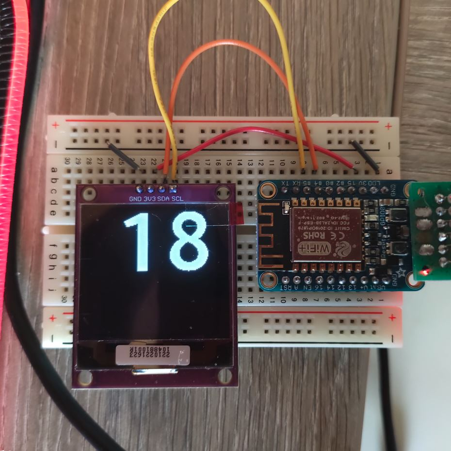
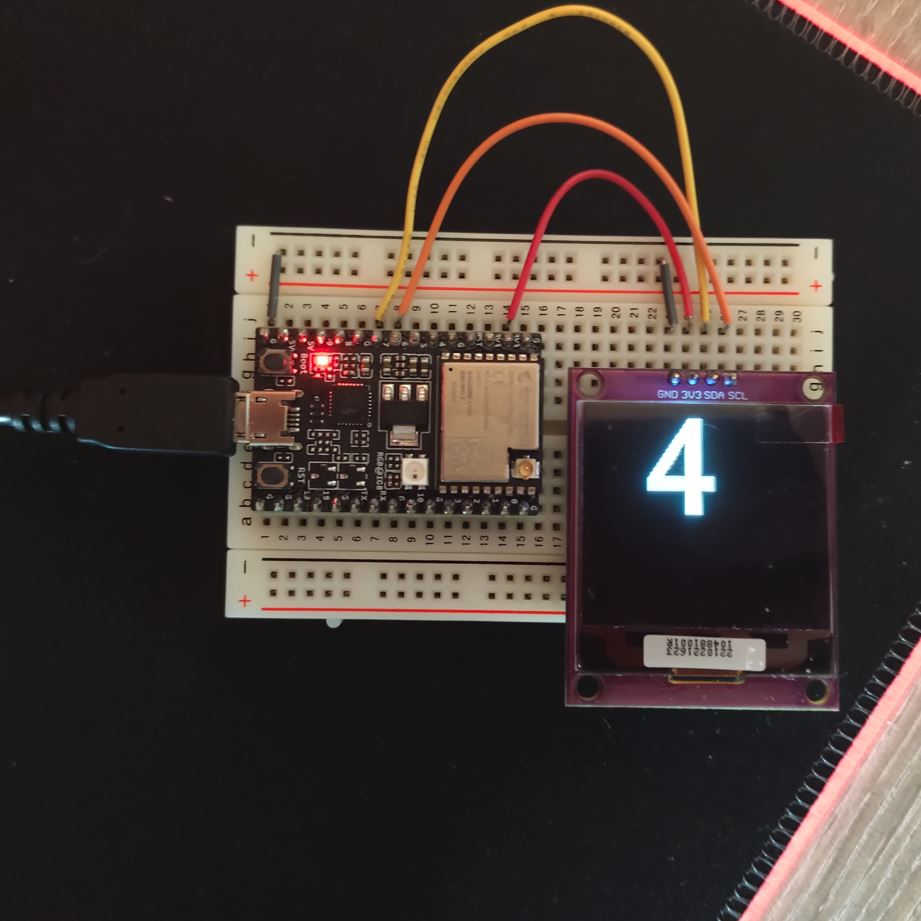

# Zio Qwiic test repo
This repository contains a Platformio project for me to test out the [Zio Qwiic OLED Display (1.5inch, 128x128) ](https://www.smart-prototyping.com/Zio/zio-modules/Zio-Qwiic-OLED-Display-1_5inch-128x128).

There are two environments configured for the two boards I have right now at my disposal:
* [Adafruit Huzzah ESP 8266](https://learn.adafruit.com/adafruit-huzzah-esp8266-breakout/pinouts)
* [ESP32-C3 Devkit M1](https://docs.espressif.com/projects/esp-idf/en/latest/esp32c3/hw-reference/esp32c3/user-guide-devkitm-1.html)

The Adafruit Huzzah has hardware I2C built-in, so I'm using the HW version of the SSD1327 for it. It is _noticably_ faster the software I2C version.
It uses GPIO4 (SDA) and GPIO5 (SCL) for I2C.

The ESP32-C3 doesn't have hardware I2C so we have to use the much slower software implementation (it takes 5 seconds for a single frame to be processed).
I used GPIO6 for SCL and GPIO7 for SDA, but these can be changed in the [platformio.ini](platformio.ini) config.

The [program](src/main.cpp) itself is fairly simple, it's just a simple counter that starts at 0 and probably continuous untill it overflows.